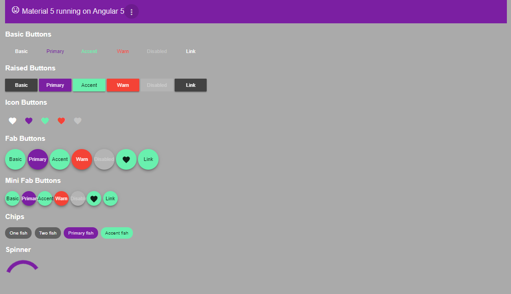

# Angular 5 + Material 5 Boilerplate

This is for teaching and learning purpose. It shows that you can bring down an Angular + Material project to roughly 1.3 MB raw code and less than 0.3 MB gzipped. I'm going to improve this further to show the ability to shrink a fully equipped Angular environment for production.

## Goal

This project shows a simple Angular setup with a few parts almost everybody needs:

* Angular 5.2
* Material 5.0
* Gulp Build System

The main focus is size of the final app. The project has two modes it can be compiled in:

1. Classic
2. AoT (Ahead Of Time)

Even AoT is build on top of SystemJS and Gulp. The outcome is, of course, different:

1. Classic Compilation using *tsc* and rollup with *systemJSBuilder*. 

The results with just one component and only icons and buttons are as small as this:

* main.bundle.js.gz : 311 KB (all of Angular and my app) -- 1370 KB unzipped
* vendor.js.gz : 59 KB (all polyfills) -- 182 KB unzipped
* site.css : 7 KB (Material's CSS) -- 43 KB unzipped

To be more realistic, I have added more of the material controls, the router and four components (numbers in KB):

|          | Raw     | Zipped  |
|----------|---------|---------|
| Bundled  | 5,884   | 877     |  
|----------|---------|---------|
| +        |         |         |
| Minified | 2,130   | 424     |
|----------|---------|---------|
| +        |         |         |
| Mangled  | 1,458   | 331     |

The tree shaking (rollup) has almost no influence as the settings in SystemJS include only the stuff we really need anyway.

2. AoT Compilation with *ngc* and rollup with *systemJSBuilder*:

* main.bundle.js.gz : 224 KB (all of Angular and my app) -- 1035 KB unzipped
* vendor.js.gz : 59 KB (all polyfills) -- 182 KB unzipped
* site.css : 7 KB (Material's CSS) -- 43 KB unzipped

This is slightly smaller and loads slightly faster. The difference is not revolutionary, but it's there. In fact, although you’re able to get rid of the compiler, AoT can increases your bundle size. What AoT does is to generate code for your templates and DI, so if you **have a lot of components** the JavaScript generated for the templates may **exceed** the size of the compiler. This is why we need both options.

> If one wonders why it's bigger as comparable projects remember that the whole CDK core is in here to support any material derived components. This is a much more realistic approach than others do to shrink an app as much as possible but forget that the outcome has almost no relation to real projects. 

## How it Works?

See [this document](docs/how-it-works.md) for details about the used techniques.

The outcome is extremely simple and it's not really an app. However, it shows that it works:

## Why Gulp?

I'm not going here with WebPack for a reason. First, I want to have a build system that can do more. Even very special tasks. So Gulp it is. The roolup is quite good and not better in WebPack. My TS code can have everything. No limits, no restrictions. It's easy to learn und to understand, because it's just a collection of single tasks.

## Prerequisits

You need **NodeJS**, **npm** (which comes with NodeJS), **gulp** and **http-server**. If the latter are missing, run this:

~~~
npm i gulp http-server -g
~~~

## How to use?

Clone the repo. Run this:

~~~
npm install
~~~

Then decide to test either classic compilation or AOT compilation. The classic approach is more robust and can handle almost everything TypeScript can do. Here you go:

~~~
npm run build
~~~

The AOT approach is a bit more strange in some parts, it may require tweaking code here and there. To build this version, which produces a 30% smaller outcome, type this:

~~~
npm run aot
~~~

Once the ./dist folder appears and there are no errors at all, just run the server:

~~~
npm start
~~~

Navigate to browser `http://localhost:3001`. That's it.

## What is NOT in there

This is NOT a WebPack project. This is intentionally. I'm using other stuff to have more control and better insight, which is good for learning. 

This project has no hotloading, hotserving, no unit testing and other cool stuff. This is a demo project to understand the build and bundle procedures. It's not for production use.

